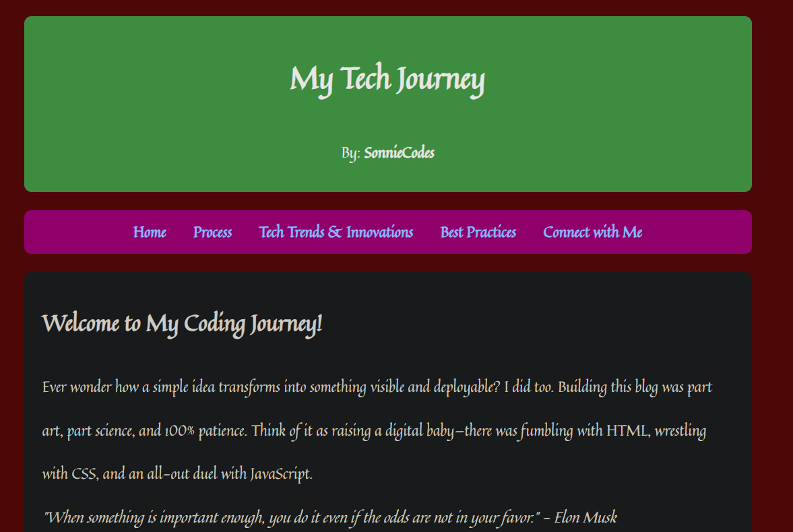

# SonnieCodes-Tech-Journey

Blog Project: Industry Trends, Innovative Technologies, and Best Practices

### Project Overview

As part of Phase 1, you are tasked with developing an insightful and engaging blog. This blog will explore key industry trends, innovative technologies, and best practices within the tech industry. The goal is to share knowledge, demonstrate research skills, and provide value to the audience while enhancing your blogging capabilities.

### Deliverables

A fully developed blog article covering:

    * A relevant industry trend or emerging technology.

    * Insights on how it my journey has been so far.

    * Best practices I have learnet.
    

